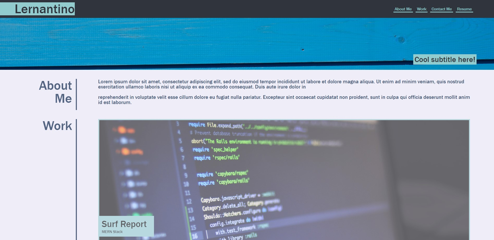
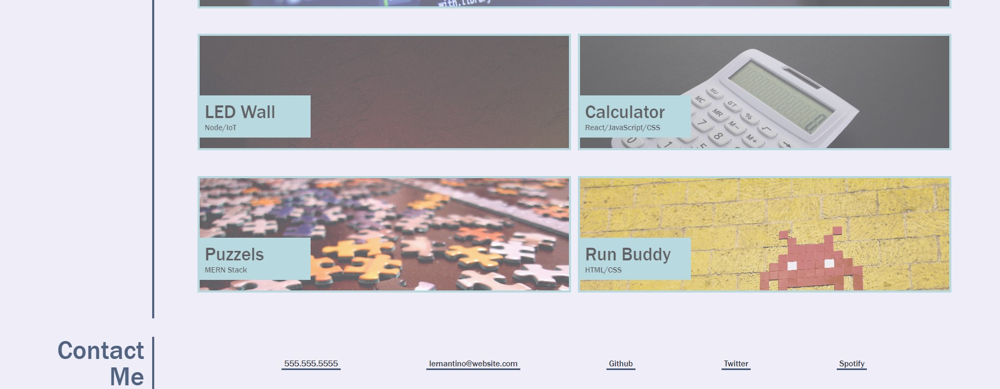
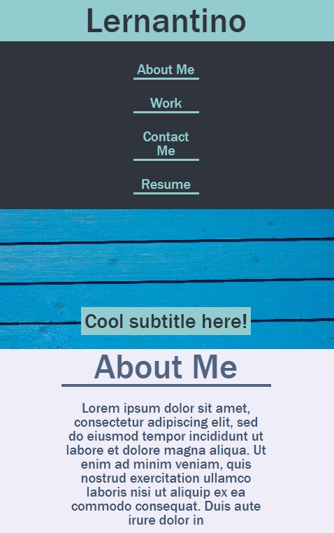
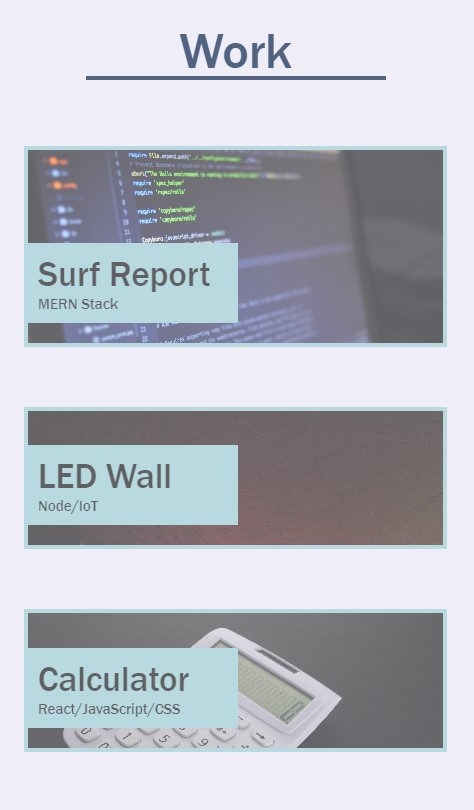

# 02-Module-Professional-Portfolio
Homework for Week 1: Module 02: Advanced CSS
___
## Professional Portfolio
### [Lernantino's Portfolio](https://josejpd3.github.io/02-Module-Professional-Portfolio/) is a simple but well structured site that is able contain all of your professional information, achievements and contact information.
___

### **Navagation Bar**

This site has a navagation bar that allows for easy and quick access different sections of the page like :

**About Me** **|** **Work** **|** **Contact Me** **|** **Resume**

___

### **Work Section**

This section allows you to display your best works and demonstrate your skills.

Each section within the work section allows you to display a preview of the project and when clicked upon directs you to the running project. 

Each one allows you to enter a name and the technologies used during the course of the project.

When hovering upon each work, the section increases its visibility for that specific work, in order to draw in the viewer's focus.

___

### **Contact Me Section**

This sections allows you to display multiple methods to contact you, making it more accesible for employers to reach out.

___

## Other Important Information

Responsive layout that adapts to various screens and devices

Structured and organized code

Semantic

___

___
## Responsive Layout

